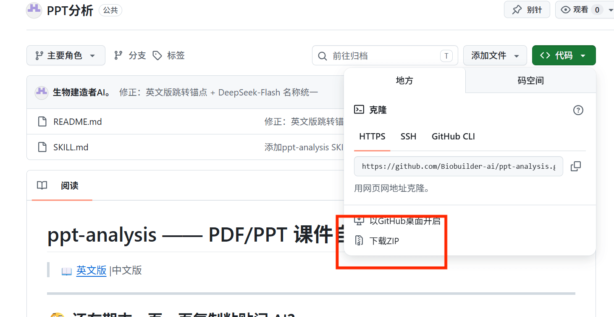
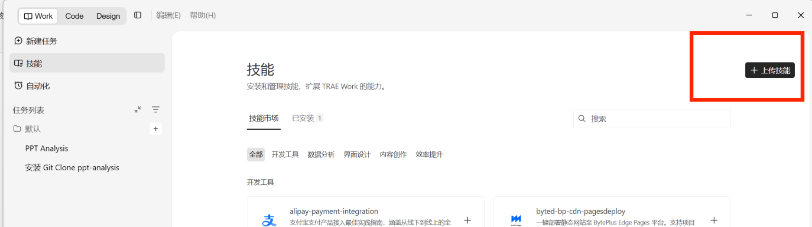
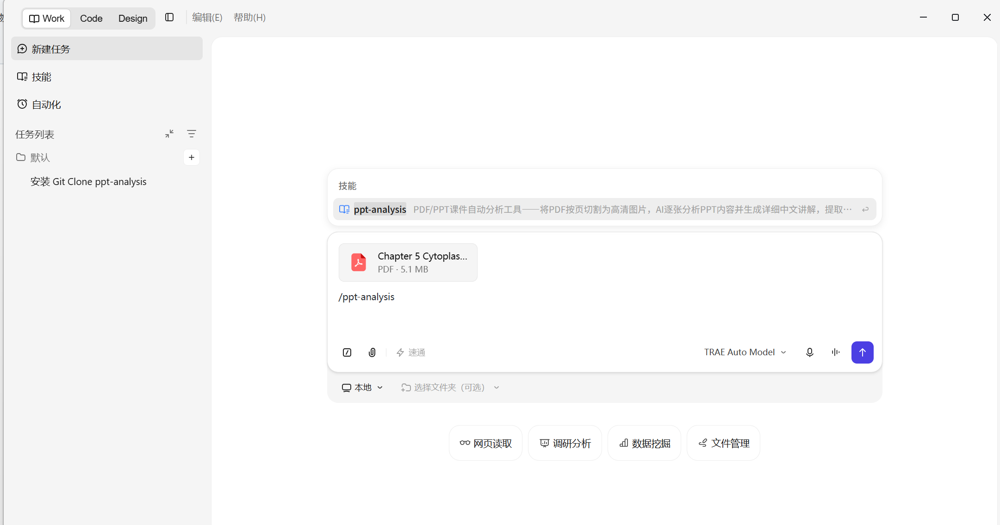
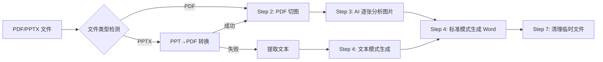
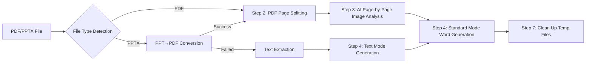

# ppt-analysis —— PDF/PPT 课件自动分析工具 🎓

> 📖 [English Version](#english-version-) | 中文版

---

## 🤔 还在期末一页一页复制粘贴问 AI？

考试周凌晨三点，你对着几百页的英文 PPT 课件，机械地截图→粘贴→问 AI→复制回答→整理笔记……一页操作下来好几分钟，一门课几十上百页，通宵都搞不完。

**这个 Skill 就是为终结这种流水线式折磨而生的。**

---

### 👨‍🔬 开发者的话

我本人是生物专业的学生，日常面对大量的英文 PPT 课件和专业名词——**Mitochondrial respiratory chain complex**、**Golgi cisternal maturation**、**ubiquitin-proteasome pathway**……每看到一个生僻术语就得切屏查词典，一页 PPT 光查词就要五分钟。

更崩溃的是，课件里大量的实验流程图、信号通路示意图、电镜照片——这些**视觉内容**纯文本 AI 根本看不懂，只能自己硬啃。

于是我把这个工作流做成了自动化 Skill：**扔一个 PDF 进去，自动切图 → 多模态 AI 逐页识别（图表+文字）→ 输出结构化的 Word 笔记，英文术语自动提取并附带中文解释。**

从此复习效率提升 10 倍，期末不再熬夜。🎉

---

[](LICENSE)
[]()
[]()

---

## 🎯 核心功能

| 功能 | 说明 |
|------|------|
| 📄 **PDF 课件分析** | 高精度切图（2倍缩放），AI 逐页视觉识别并生成中文详解 |
| 🖼️ **PPT(X) 课件分析** | 自动通过 COM / LibreOffice 转为 PDF 后分析，或 fallback 提取文本 |
| 📝 **Word 文档生成** | 输出结构化 .docx 文件，含封面、逐页详解、术语汇总表 |
| 🔤 **英文术语提取** | 自动识别专业英文术语，附带中文解释，按重要性分级标注 |
| 🎨 **微软雅黑排版** | 全文统一字体，杜绝意外加粗，格式规范 |

---

## 🧠 强烈建议搭配多模态视觉模型

此 Skill 的核心能力依赖于**多模态大模型的视觉理解能力**——模型需要能够"看懂" PPT 图片中的图表、公式、实验数据、流程示意图等内容。

> ⚠️ **纯文本模型无法充分发挥此 Skill 的能力。**

### 🌟 首推模型：MiMo V2.5（小米全模态模型）

**[MiMo V2.5](https://platform.xiaomimimo.com?ref=25N3LT)** 是目前市面上性价比最高的全模态模型：

- 🎯 **全模态输入**：支持文本 + 图像 + 视频 + 音频输入
- 💰 **价格实惠**：与 DeepSeek-Flash 同一价位区间
- 👁️ **视觉理解强**：对中文 PPT 课件中的图表、公式、示意图有出色的识别能力
- ⚡ **推理速度快**：适合批量处理多页课件

对比其他模型：

| 模型 | 图像输入 | 价格 | 中文理解 |
|------|:------:|------|:------:|
| **MiMo V2.5** | ✅ 全模态 | 💰 实惠 | ⭐⭐⭐⭐⭐ |
| DeepSeek-Flash | ❌ 不支持 | 💰 实惠 | ⭐⭐⭐⭐ |
| GPT-4o | ✅ 支持 | 💰💰💰 昂贵 | ⭐⭐⭐⭐ |

### 🎁 专属福利

**通过邀请码注册 MiMo 开放平台，立享 ¥10 API 体验金 + 首单 9 折优惠：**

> 🔗 **注册链接：** [https://platform.xiaomimimo.com?ref=25N3LT](https://platform.xiaomimimo.com?ref=25N3LT)
> 
> 🎫 **邀请码：** `25N3LT`
> 
> *（注册后自动填入 · 体验金 40 天有效）*

---

## 📥 零基础安装指南（从没玩过 AI 智能体也能上手 🐣）

> 不会编程？第一次用 AI Agent？没关系！跟着下面一步一步操作，10 分钟搞定。

---

### 第 0 步：确认你的电脑有 Python

**Windows 用户：**

1. 按键盘 `Win + R`，输入 `cmd`，回车
2. 在弹出的黑色窗口中输入以下命令并回车：
   ```
   python --version
   ```
3. 如果显示 `Python 3.8.x` 或更高版本 → ✅ 已安装，跳到第 1 步
4. 如果显示"不是内部或外部命令" → 需要安装 Python

**安装 Python（如需要）：**

1. 打开浏览器，访问：**https://www.python.org/downloads/**
2. 点击页面中央的黄色大按钮 **"Download Python 3.x.x"**
3. 下载完成后，双击运行安装包
4. ⚠️ **重要！** 勾选底部的 **"Add Python to PATH"** 复选框
5. 点击 **"Install Now"**，等待安装完成
6. 重新打开 `cmd`，再次输入 `python --version` 确认成功

**Mac 用户：**

1. 打开"终端"（在启动台搜索 Terminal）
2. 输入 `python3 --version`，回车
3. 如果没有，访问 https://www.python.org/downloads/ 下载安装

---

### 第 1 步：下载 Skill 文件

1. 打开本仓库页面（你现在就在看）
2. 点击绿色的 **"<> Code"** 按钮
3. 选择 **"Download ZIP"**
4. 将下载的 ZIP 文件**解压到你喜欢的文件夹**（比如桌面上的 `ppt-analysis` 文件夹）



或者，如果你安装了 Git，在命令行输入：
```
git clone https://github.com/Biobuilder-ai/ppt-analysis.git
```

---

### 第 2 步：选择并安装 AI 智能体

本 Skill 可在多种 AI 智能体（AI Agent / AI Coding Assistant）中使用，包括 **Claude Code**、**Cline**、**Codex**、**Trae** 等。

> ⭐ **第一次用智能体？强烈推荐 Trae —— 字节跳动旗下，国内直接下载，完全免费，中文友好！**

#### 🔥 推荐：下载 Trae Work 版（零基础首选）

1. 打开浏览器，访问：**[https://www.trae.cn/ide/download](https://www.trae.cn/ide/download)**
2. 下载适合你系统的版本（Windows / macOS）
3. 双击安装包，一路"下一步"即可完成安装
4. 打开 Trae Work 版，你会看到一个类似 VS Code 的界面——这就是你的 AI 编程助手

> 💡 **什么是 Trae？** Trae 是字节跳动推出的免费 AI 智能体 IDE，内置多模态大模型，无需额外配置 API Key，打开就能用。非常适合国内用户。

#### 其他智能体选择（有经验用户）

| 智能体 | 特点 | 适合人群 |
|--------|------|----------|
| **Trae** | 国内免费、中文友好、无需配置 | ⭐ 零基础首选 |
| **Claude Code** | Anthropic 官方、命令行式 | 有命令行经验的开发者 |
| **Cline** | VS Code 插件、灵活配置 | VS Code 用户 |
| **Codex** | OpenAI 出品、云端运行 | 有 API Key 的用户 |

---

### 第 3 步：在 Trae 中导入 Skill

1. 打开 Trae Work 版
2. 点击左侧栏的 **"技能管理"**（Skills）图标
3. 点击 **"导入技能"** 或 **"添加技能"** 按钮
4. 选择你解压出来的文件夹中的 `SKILL.md` 文件
5. 确认技能列表中出现了 **"ppt-analysis"**，状态为已启用 ✅



> 💡 **其他智能体配置方法：** Claude Code / Cline / Codex 用户将 `SKILL.md` 放入项目根目录的 `.agents/skills/ppt-analysis/` 文件夹即可自动识别。

---

### 第 4 步：开始使用！调用技能

技能导入成功后，你可以通过两种方式使用它：

#### 🗣️ 方式一：主动调用

在 Trae 的对话框中，直接输入：

> "帮我分析这个 PDF 课件：你的文件路径/pdf文件名.pdf"

AI 会自动识别并调用 ppt-analysis 技能，开始切图分析。

#### 🤖 方式二：被动触发

直接把 PDF/PPT 文件拖入对话框，发送消息。智能体检测到课件文件后，会自动匹配并激活 ppt-analysis 技能。



> ✨ **技能被激活后，AI 会自动：切图 → 逐页识别 → 生成带图片的 Word 讲解文档。你只需要等待结果！**

---

### 🆘 常见问题

| 问题 | 解决方法 |
|------|----------|
| `pip` 命令找不到 | 安装 Python 时没有勾选 "Add Python to PATH"，重新安装并勾选 |
| `Permission denied` 错误 | 在命令前加 `sudo`（Mac）或以管理员身份运行 cmd（Windows） |
| PyMuPDF 安装失败 | 运行 `pip install --upgrade pip` 后再试 |
| Skill 没有被识别 | 检查 SKILL.md 是否在正确的文件夹路径中 |
| PPT 无法转 PDF | Windows：安装 Microsoft PowerPoint；Mac：安装 LibreOffice |
| Trae 找不到技能管理 | 确认下载的是 **Trae Work 版**（不是普通版），更新到最新版本 |
| 切图后没有反应 | 检查 Python 依赖是否完整安装（`pip install PyMuPDF python-docx`） |

---

## 🚀 工作流程



1. **文件类型检测** — 自动识别 .pdf / .pptx，PPT 优先转为高清 PDF
2. **PDF 切图** — 2倍缩放渲染每页为高清 PNG
3. **AI 逐张分析** — 多模态模型以专业教师角色识别图表、公式、数据，生成详细中文讲解
4. **Word 生成** — 生成结构化 .docx 文档，每页包含 PPT 原图 + 教师讲解 + 术语表
5. **术语汇总** — 专家级筛选和分级标注（★★★必掌握 / ★★重要 / ★了解）
6. **格式控制** — 微软雅黑字体，显式控制每个 Run 的格式，杜绝意外加粗
7. **清理** — 自动删除临时图片

---

## 📂 输出文档结构

- **封面页** — 文件标题 + 总页数
- **逐页详解** — 每页包含：标题、PPT 原图嵌入、专业教师详细讲解、英文术语表
- **附录** — 按字母排序的英文名词解释汇总表（序号 | 优先级 | 英文术语 | 中文解释 | 专家补充说明）

---

## 🖥️ 系统要求

- Python 3.8+
- Windows / macOS / Linux
- PDF 模式：无额外要求
- PPT 模式（最佳体验）：安装 Microsoft PowerPoint（Windows）或 LibreOffice（跨平台）

---

## ⚠️ 注意事项

1. 每次只处理一个文件
2. 超过 30 页的 PDF 建议分批处理
3. 任务完成后自动清理临时图片目录
4. 确保使用的 AI 模型支持图像输入（多模态），否则分析质量大幅下降

---

## 🔗 相关链接

- [Trae 智能体下载](https://www.trae.cn/ide/download) — 字节跳动免费 AI Agent，零基础首选
- [MiMo 开放平台注册](https://platform.xiaomimimo.com?ref=25N3LT) — 邀请码 `25N3LT`
- [SKILL.md 技能定义文档](https://github.com/Biobuilder-ai/ppt-analysis/blob/main/SKILL.md)

---

## 📄 License

MIT License — 自由使用、修改和分发。

---

---

# English Version 🇬🇧

> [📖 中文版](#ppt-analysis--pdfppt-课件自动分析工具-)

---

## 🤔 Still Copy-Pasting PPT Pages to AI One by One During Finals?

It's 3 AM during exam week. You're staring at hundreds of pages of English lecture slides, mechanically going through: screenshot → paste → ask AI → copy answer → organize notes... Several minutes per page, dozens to hundreds of pages per course — you'll be up all night.

**This Skill was built to end this assembly-line misery.**

---

### 👨‍🔬 From the Developer

I'm a biology student who faces mountains of English PPT slides and technical jargon daily — *Mitochondrial respiratory chain complex*, *Golgi cisternal maturation*, *ubiquitin-proteasome pathway*... Every unfamiliar term means switching windows to look it up, costing five minutes per page just for vocabulary.

Even worse, course slides are packed with experimental flowcharts, signaling pathway diagrams, and electron micrographs — **visual content** that text-only AI models simply cannot understand. You're left to decipher them on your own.

So I automated this workflow into a Skill: **drop in a PDF, automatic page splitting → multimodal AI analysis of every page (diagrams + text) → structured Word notes with English terms auto-extracted and explained in Chinese.**

10x review efficiency boost. No more all-nighters. 🎉

---

## 🎯 Core Features

| Feature | Description |
|------|------|
| 📄 **PDF Analysis** | High-res page rendering (2x zoom), AI visual recognition with Chinese explanations |
| 🖼️ **PPT(X) Analysis** | Auto-convert via COM / LibreOffice to PDF, or fallback text extraction |
| 📝 **Word Generation** | Structured .docx output with cover, per-page analysis, and glossary |
| 🔤 **Term Extraction** | Automatic English terminology identification with Chinese definitions, graded by importance |
| 🎨 **Clean Formatting** | Microsoft YaHei font throughout, zero accidental bold issues |

---

## 🧠 Strongly Recommend Pairing with a Multimodal Vision Model

This Skill's core capability depends on the **visual understanding of multimodal LLMs** — the model needs to "see" diagrams, formulas, experimental data, and flowcharts in lecture slides.

> ⚠️ **Text-only models cannot fully leverage this Skill's power.**

### 🌟 Top Pick: MiMo V2.5 (Xiaomi Full-Modality Model)

**[MiMo V2.5](https://platform.xiaomimimo.com?ref=25N3LT)** is the most cost-effective full-modality model on the market:

- 🎯 **Full-Modality Input**: Text + Image + Video + Audio
- 💰 **Affordable**: Same price tier as DeepSeek-Flash
- 👁️ **Strong Visual Understanding**: Excellent at recognizing charts, formulas, and diagrams in Chinese lecture slides
- ⚡ **Fast Inference**: Suitable for batch processing multi-page course materials

| Model | Image Input | Price | Chinese Understanding |
|------|:------:|------|:------:|
| **MiMo V2.5** | ✅ Full | 💰 Affordable | ⭐⭐⭐⭐⭐ |
| DeepSeek-Flash | ❌ No | 💰 Affordable | ⭐⭐⭐⭐ |
| GPT-4o | ✅ Yes | 💰💰💰 Expensive | ⭐⭐⭐⭐ |

### 🎁 Exclusive Offer

**Register on MiMo Open Platform with invitation code to get ¥10 credit + 10% off first order:**

> 🔗 **Registration:** [https://platform.xiaomimimo.com?ref=25N3LT](https://platform.xiaomimimo.com?ref=25N3LT)
> 
> 🎫 **Invitation Code:** `25N3LT`
> 
> *(Auto-filled after registration · Credit valid for 40 days)*

---

## 📥 Zero-Base Installation Guide (First time using AI agents? Start here 🐣)

> No coding experience? Never touched an AI Agent? No worries! Follow along, done in 10 minutes.

---

### Step 0: Make Sure You Have Python

**Windows:**

1. Press `Win + R`, type `cmd`, hit Enter
2. In the black window, type and press Enter:
   ```
   python --version
   ```
3. If you see `Python 3.8.x` or higher → ✅ Installed, skip to Step 1
4. If you see "not recognized" → Need to install Python

**Install Python (if needed):**

1. Open browser, visit: **https://www.python.org/downloads/**
2. Click the big yellow **"Download Python 3.x.x"** button
3. After download, double-click the installer
4. ⚠️ **Important!** Check **"Add Python to PATH"** at the bottom
5. Click **"Install Now"**, wait for completion
6. Reopen `cmd`, type `python --version` to confirm

**Mac:**

1. Open Terminal (search in Launchpad)
2. Type `python3 --version`, press Enter
3. If not found, visit https://www.python.org/downloads/

---

### Step 1: Download the Skill Files

1. Open this repository page (you're already here)
2. Click the green **"<> Code"** button
3. Select **"Download ZIP"**
4. Extract the ZIP to your preferred folder (e.g., `ppt-analysis` on your desktop)


Or, if you have Git installed, run:
```
git clone https://github.com/Biobuilder-ai/ppt-analysis.git
```

---

### Step 2: Choose & Install an AI Agent

This Skill works with multiple AI agents including **Claude Code**, **Cline**, **Codex**, and **Trae**.

> ⭐ **First time with AI agents? We highly recommend Trae — by ByteDance, free download, no API key needed, Chinese-friendly!**

#### 🔥 Recommended: Download Trae Work Edition (Best for beginners)

1. Open browser, visit: **[https://www.trae.cn/ide/download](https://www.trae.cn/ide/download)**
2. Download the version for your OS (Windows / macOS)
3. Double-click the installer and follow the default setup
4. Open Trae Work Edition — you'll see an interface similar to VS Code. This is your AI coding assistant!

> 💡 **What is Trae?** Trae is a free AI Agent IDE by ByteDance with built-in multimodal models. No API key configuration needed — open and go. Perfect for users in China.

#### Other Agent Options (for experienced users)

| Agent | Highlights | Best For |
|--------|------|----------|
| **Trae** | Free in China, Chinese-friendly, zero config | ⭐ First-time users |
| **Claude Code** | Official Anthropic, CLI-based | Developers with terminal experience |
| **Cline** | VS Code extension, flexible setup | VS Code users |
| **Codex** | By OpenAI, cloud-based | Users with API keys |

---

### Step 3: Import the Skill in Trae

1. Open Trae Work Edition
2. Click the **"Skills"** icon in the left sidebar
3. Click **"Import Skill"** or **"Add Skill"**
4. Select the `SKILL.md` file from your extracted folder
5. Confirm **"ppt-analysis"** appears in the skill list with status ✅ enabled


> 💡 **Other agents:** Claude Code / Cline / Codex users — place `SKILL.md` into `.agents/skills/ppt-analysis/` in your project root for auto-detection.

---

### Step 4: Start Using! Invoke the Skill

Once imported, you can use the skill in two ways:

#### 🗣️ Method 1: Active Invocation

In the Trae chat, simply type:

> "Help me analyze this PDF lecture: path/to/your/file.pdf"

The AI will auto-detect and invoke the ppt-analysis skill, starting the page splitting and analysis.

#### 🤖 Method 2: Passive Trigger

Drag and drop a PDF/PPT file directly into the chat and send a message. The agent detects the lecture file and automatically activates ppt-analysis.


> ✨ **Once activated, the AI will automatically: split pages → analyze each page → generate a Word document with embedded images and detailed explanations. Just wait for the result!**

---

### 🆘 FAQ

| Problem | Solution |
|------|----------|
| `pip` command not found | Python was installed without "Add Python to PATH" — reinstall with that option checked |
| `Permission denied` error | Add `sudo` before command (Mac) or run cmd as Administrator (Windows) |
| PyMuPDF install fails | Run `pip install --upgrade pip` first |
| Skill not recognized | Check that SKILL.md is in the correct folder path |
| Can't convert PPT to PDF | Windows: install Microsoft PowerPoint; Mac: install LibreOffice |
| Can't find Skill manager in Trae | Make sure you downloaded **Trae Work Edition** (not regular), update to latest version |
| No response after page splitting | Check Python dependencies (`pip install PyMuPDF python-docx`) |

---

## 🚀 Workflow



1. **File Type Detection** — Auto-detect .pdf / .pptx; PPT is converted to high-res PDF first
2. **PDF Page Splitting** — 2x zoom rendering of each page to high-res PNG
3. **AI Page Analysis** — Multimodal model acts as a professional teacher, identifying diagrams, formulas, data
4. **Word Generation** — Produces structured .docx with embedded images + teacher explanations + term glossary per page
5. **Term Glossary** — Expert-level filtering and grading (★★★ Essential / ★★ Important / ★ Reference)
6. **Format Control** — Microsoft YaHei font, explicit control over every Run's formatting
7. **Cleanup** — Auto-delete temporary images

---

## 📂 Output Document Structure

- **Cover Page** — File title + total page count
- **Per-Page Analysis** — Each page includes: title, embedded original image, professional teacher explanation, English term list
- **Appendix** — Alphabetically sorted glossary table (No. | Priority | English Term | Chinese Definition | Expert Notes)

---

## 🖥️ System Requirements

- Python 3.8+
- Windows / macOS / Linux
- PDF mode: no extra requirements
- PPT mode (best experience): install Microsoft PowerPoint (Windows) or LibreOffice (cross-platform)

---

## ⚠️ Notes

1. Process one file at a time
2. For PDFs over 30 pages, consider batch processing
3. Temporary images are auto-cleaned after task completion
4. Ensure your AI model supports image input (multimodal), otherwise analysis quality will degrade significantly

---

## 🔗 Links

- [Trae Agent Download](https://www.trae.cn/ide/download) — Free ByteDance AI Agent, best for beginners
- [MiMo Open Platform Registration](https://platform.xiaomimimo.com?ref=25N3LT) — Invitation code `25N3LT`
- [SKILL.md Definition Document](https://github.com/Biobuilder-ai/ppt-analysis/blob/main/SKILL.md)

---

## 📄 License

MIT License — Free to use, modify, and distribute.